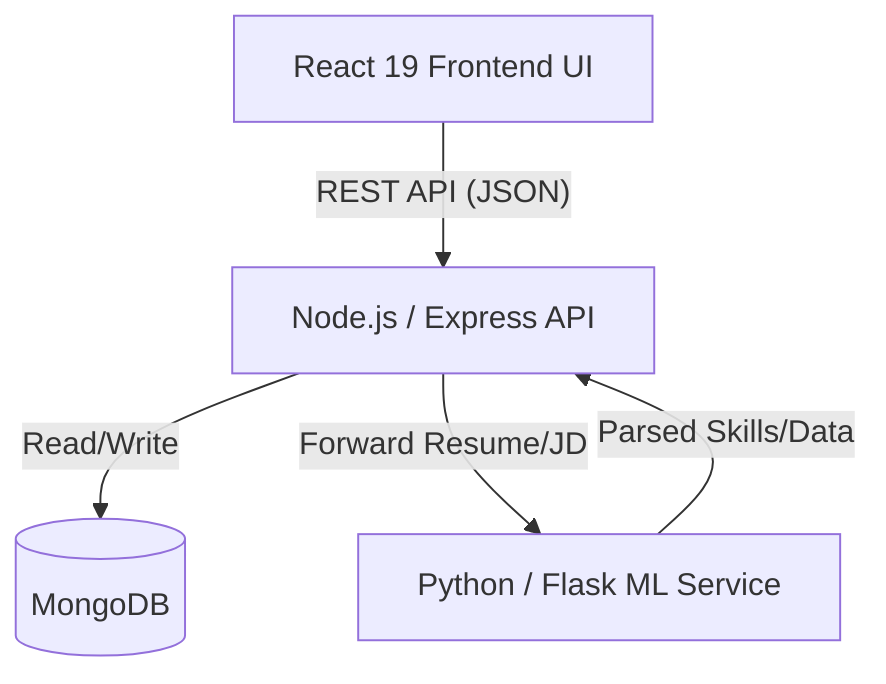
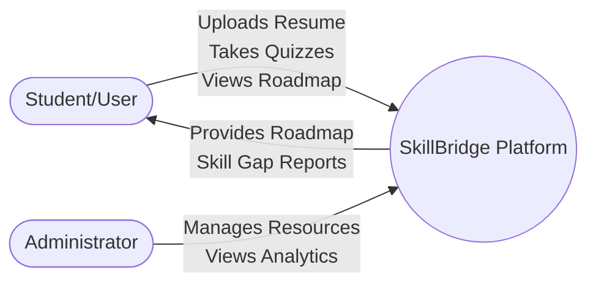
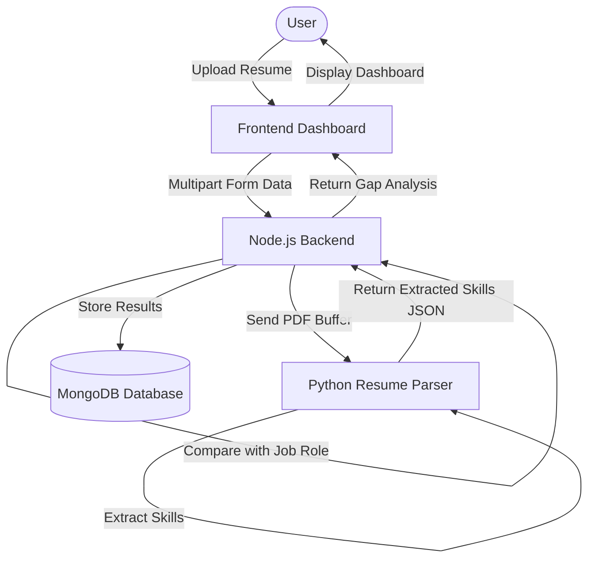
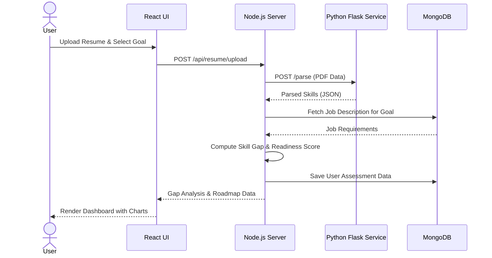

# SkillBridge: Personalized Learning and Skill Gap Analysis Platform

**BMS INSTITUTE OF TECHNOLOGY & MANAGEMENT**
Department of MCA

---

## 1. INTRODUCTION

### 1.1 Project Description

SkillBridge is a full-stack web application developed using the MERN stack (MongoDB, Express, React, Node.js) augmented by a Python Flask micro-service for natural language processing. The system supports multiple active modules, all governed by a central feature registry that makes the architecture inherently modular and safe to extend without breaking existing functionality.

The platform combines resume intelligence, job description analysis, and adaptive assessments into a single, data-driven ecosystem. The React frontend provides an interactive and responsive user interface, while Node.js and Express manage authentication, business logic, and communication. MongoDB stores user information, assessment records, and learning data. The dedicated Python Flask service performs computationally intensive resume parsing and skill extraction using NLP techniques, keeping it independent of the main application.

#### 1.1.1 Why Personalized Learning & Skill Gap Analysis

The rapid growth of technology has transformed recruitment practices across almost every industry. Employers now expect candidates to possess a combination of technical knowledge, practical experience, and problem-solving abilities that closely match the responsibilities of a specific job role. 

Although thousands of online courses and learning resources are available, many learners struggle to determine which skills they should develop first. Consequently, they often spend considerable time following generic learning paths that may not directly improve their employability. A personalized learning and skill gap analysis system addresses this by evaluating a learner's existing skills—via resume analysis—and comparing them against the actual competencies required for a targeted job role. Instead of presenting a generic list of missing skills, the system generates a precise readiness score, helping users understand their current position and the exact effort required to become job-ready.

#### 1.1.2 Motivation

The rapidly evolving job market demands that learners and professionals continuously assess and upgrade their skills. Yet, most individuals lack a structured, measurable way to understand how prepared they are for a specific job role. 

The primary motivation behind SkillBridge is to transition career preparation from a guessing game into a structured, reliable process. To improve the reliability of the analysis, the platform validates user knowledge through adaptive assessments. This reduces the dependence on self-reported skills and provides a more realistic measure of proficiency. Based on these validated results, SkillBridge recommends a prioritized learning roadmap, guiding users toward improving the most critical skills first. This approach ensures that learners invest their time efficiently, focusing only on the specific knowledge gaps that stand between them and their career goals.
### 1.2 Company / Project Profile
This system was developed as an independent academic project (Project Based Learning) to address the lack of personalized career readiness tools available to students and fresh graduates. 
*   **Project type:** Independent full-stack web application (academic/mini-project).
*   **Domain:** Educational Technology (EdTech) — career readiness, personalized learning, and skill assessment.
*   **Target users:** Students, fresh graduates, early-stage professionals, and educational administrators.

---

## 2. LITERATURE SURVEY

### 2.1 Existing and Proposed System
**Existing System**
Current learning platforms (like Coursera, Udemy, or LinkedIn Learning) primarily focus on content delivery and broad recommendations based on user interests or search history. They lack detailed, personalized skill-gap detection mapped to specific industry requirements. Users often engage in unstructured learning paths, taking courses that may not directly address their weaknesses. There is limited proficiency validation prior to course recommendation, meaning users may waste time learning what they already know or struggle with advanced topics for which they lack prerequisites.

**Proposed System**
SkillBridge proposes a targeted, data-driven ecosystem. Instead of generic suggestions, the platform actively extracts a user's current skills from their resume, maps them against specific job roles, and validates proficiency through assessments. It then provides a personalized roadmap containing only the resources needed to bridge identified gaps. The architecture supports continuous progress tracking and re-assessment to ensure accountability.

### 2.2 Feasibility Study
#### 2.2.1 Technical Feasibility
The system is built on a mature and widely adopted MERN-like stack (MongoDB, Express, React, Node.js) augmented with a Python microservice for specialized NLP tasks. Using React 19 and Vite ensures a highly responsive frontend, while Node.js and MongoDB provide a scalable backend for handling user data and learning resources. The separation of the machine learning/parsing logic into a Python Flask service ensures that computationally heavy text-processing tasks do not block the main backend API. 

#### 2.2.2 Operational Feasibility
The platform is designed with user-centric dashboards. Students interact with clear visual indicators of their skill gaps (e.g., radar charts, progress bars) and straightforward workflows for uploading resumes and taking quizzes. This minimizes the learning curve and encourages consistent engagement. 

#### 2.2.3 Economic Feasibility
The platform utilizes open-source technologies (React, Node.js, Express, Flask, MongoDB Community Edition) which incur no licensing costs. For deployment, cloud platforms offering free tiers or low-cost instances (e.g., Render, AWS EC2 t3.micro, MongoDB Atlas) are utilized, making the project highly cost-effective to host and maintain.

### 2.3 Tools and Technologies Used

| Category | Technology / Library | Version | Purpose |
| :--- | :--- | :--- | :--- |
| **UI Framework** | React | ^19.0.0 | Component-based UI, hooks & state |
| **Build Tool** | Vite | ^6.2.1 | Dev server & production bundling |
| **Styling** | Tailwind CSS | ^4.3.0 | Utility-first responsive styling |
| **Routing** | React Router DOM | ^7.3.0 | Client-side routing & route guards |
| **Animation** | Framer Motion | ^12.40.0 | UI transitions and micro-animations |
| **Backend Runtime**| Node.js / Express| ^4.21.2 | Core REST API server |
| **Database** | MongoDB / Mongoose | ^8.12.1 | NoSQL database for users & roadmaps |
| **Authentication** | JSON Web Token (JWT)| ^9.0.2 | Secure stateless session management |
| **ML/Parsing** | Python / Flask | 3.1.0 | Microservice for document parsing |
| **PDF Processing** | pdf-parse (Node) / pypdf (Python) | Various | Extracting text from uploaded resumes |

### 2.4 Hardware and Software Requirements

| Type | Requirement |
| :--- | :--- |
| **Hardware (Client)** | Any PC/laptop/mobile device capable of running a modern browser. |
| **Hardware (Server)** | Intel Core i5 or higher (i7 recommended for NLP workloads), minimum 8 GB RAM. |
| **Operating System** | Windows 10/11, macOS, or Linux. |
| **Browser** | Google Chrome, Microsoft Edge, or Mozilla Firefox. |
| **Development Runtime** | Node.js 18+, npm, Python 3.x. |
| **IDE** | Visual Studio Code. |

---

## 3. SOFTWARE REQUIREMENTS SPECIFICATION

### 3.1 Users

| Role | Primary Responsibilities in SkillBridge |
| :--- | :--- |
| **Student / User** | Register/login, upload resume, set career goals, take skill assessments, view gap analysis, follow learning roadmaps, track progress. |
| **Admin** | Manage learning resources, view system-wide analytics, manage user accounts. |

#### 3.1.1 Scope and Objective
The scope of SkillBridge covers the end-to-end journey of a job seeker: from initial skill assessment via resume parsing to targeted learning and proficiency validation. The objective is to eliminate guesswork in career preparation by providing actionable, data-backed learning paths that map directly to industry needs.

#### 3.1.2 Assumptions and Dependencies
*   Users have access to their resumes in standard digital formats (PDF/DOCX).
*   The system relies on up-to-date learning resource links (courses, articles, projects) being available in the database.
*   Internet connectivity is required for the client application to communicate with the cloud-hosted backend APIs.

### 3.2 Functional Requirements

| ID | Requirement |
| :--- | :--- |
| **FR-1** | The system shall allow users to register and log in securely using JWT authentication. |
| **FR-2** | The system shall allow users to upload their resumes (PDF format) for automated parsing. |
| **FR-3** | The system shall extract text from uploaded resumes and identify technical and soft skills. |
| **FR-4** | The system shall compare user skills against required skills for their selected career goal and calculate a Job Readiness Score. |
| **FR-5** | The system shall provide adaptive, domain-specific quizzes to validate the user's self-reported or resume-extracted skills. |
| **FR-6** | The system shall generate a personalized learning roadmap with curated resources to address identified skill gaps. |
| **FR-7** | The system shall track user progress as they complete learning resources and re-assess their skills. |
| **FR-8** | The system shall provide a dashboard visualizing skill gaps and progress using charts (e.g., radar charts). |

### 3.3 Non-Functional Requirements

| Category | Requirement |
| :--- | :--- |
| **Usability** | The interface shall use a responsive, accessible Tailwind CSS layout to ensure usability across desktop and mobile devices. |
| **Performance** | Resume parsing and gap analysis should complete within acceptable time limits (e.g., under 5 seconds) to maintain user engagement. |
| **Scalability** | The modular architecture (separating Node API and Python ML service) shall allow independent scaling of the resource-intensive NLP parsing components. |
| **Security** | Passwords must be hashed using bcrypt before database storage. API routes containing sensitive user data must be protected using JWT verification. |

---

## 4. SYSTEM DESIGN

### 4.1 System Architecture
SkillBridge follows a multi-tier microservice-oriented architecture. The Presentation Layer is a React 19 SPA. The Application Layer consists of a Node.js/Express primary backend that handles business logic and a secondary Python/Flask service dedicated to NLP and resume parsing. The Data Layer utilizes MongoDB.



### 4.2 System Perspective
The application is designed to be highly modular. The separation of the backend into a core Node.js server and a Python ML service ensures that the heavy computational tasks of NLP parsing do not block the asynchronous event loop of the Node server. This allows for smooth handling of regular API requests (like fetching user profiles or updating progress) while processing documents in the background.

### 4.3 Context Diagram



---

## 5. DETAILED DESIGN

### 5.1 Dataflow Diagram
The data flow illustrates the core process: resume upload, parsing, gap analysis, and roadmap generation.



### 5.2 Use Case Diagram

```mermaid
usecaseDiagram
    actor Student
    actor Admin
    
    rectangle SkillBridge {
        Student --> (Register / Login)
        Student --> (Upload Resume)
        Student --> (Take Skill Assessment)
        Student --> (View Personalized Roadmap)
        Student --> (Track Progress)
        
        Admin --> (Login)
        Admin --> (Manage Learning Resources)
        Admin --> (View Platform Analytics)
    }
```

### 5.3 Sequence Diagram
This sequence diagram shows the interaction flow when a user uploads a resume to get their skill gap analysis.



---

## 6. IMPLEMENTATION

### 6.1 Snippet Code
**Server-side Module Structure (Node.js/Express)**
The backend is structured modularly. For instance, the profile routes isolate profile-specific logic:
```javascript
// server/src/modules/profile/profile.routes.js
import express from 'express';
// Route definitions for profile management
const router = express.Router();

router.get('/me', protect, getProfile);
router.put('/update', protect, updateProfile);

export default router;
```

**Client-side Routing & Protected Routes (React)**
The frontend uses React Router to protect authenticated routes:
```jsx
// client/src/App.jsx (Conceptual representation)
import { Routes, Route } from 'react-router-dom';
import Dashboard from './pages/Dashboard';
import ProtectedRoute from './components/ProtectedRoute';

function App() {
  return (
    <Routes>
      <Route path="/" element={<Home />} />
      <Route path="/login" element={<Login />} />
      <Route 
        path="/dashboard" 
        element={
          <ProtectedRoute>
            <Dashboard />
          </ProtectedRoute>
        } 
      />
    </Routes>
  );
}
```

### 6.2 Screenshots
*(Screenshots to be captured by running the application locally via `npm run dev` and navigating through the user flow.)*

| Screen | Route | What to capture |
| :--- | :--- | :--- |
| **Login / Signup** | `/login`, `/register` | User authentication interface. |
| **Profile & Resume Upload** | `/profile` | Form to upload PDF resume and set career goals. |
| **Dashboard** | `/dashboard` | Radar charts showing skill proficiencies and Job Readiness Score. |
| **Skill Assessment** | `/assessment` | Adaptive quiz interface for validating skills. |
| **Learning Roadmap** | `/roadmap` | Prioritized list of curated learning resources and timelines. |

---

## 7. SOFTWARE TESTING

### 7.1 Unit Testing
The application's modular nature supports isolated unit testing. The Python ML service's parsing accuracy can be tested by providing sample resumes and verifying the extracted skill JSON. For the Node.js backend, testing libraries (like Jest or Mocha) can be implemented to validate the logic of the Skill Gap Analyzer module without requiring database connections.

### 7.2 Automation Testing
For future work, an end-to-end testing suite using Cypress or Playwright is recommended. This would automate the critical user journey: registering, uploading a mock resume, taking a short assessment, and verifying that the generated roadmap accurately reflects the provided data.

### 7.3 Test Cases

| TC ID | Scenario | Steps | Expected Result |
| :--- | :--- | :--- | :--- |
| **TC-01** | Valid Login | Enter valid credentials and submit. | User authenticated, JWT generated, redirected to Dashboard. |
| **TC-02** | Invalid Login | Enter incorrect password. | System shows "Invalid Credentials", stays on login page. |
| **TC-03** | Resume Upload | User uploads a valid PDF resume. | File is accepted, sent to ML service, and success message is shown. |
| **TC-04** | Invalid File Format | User attempts to upload an image (.jpg). | System alerts user to upload PDF format only. |
| **TC-05** | Gap Calculation | System compares parsed skills with selected job role. | Returns accurate missing skills and Readiness Percentage. |

---

## 8. CONCLUSION
SkillBridge successfully delivers a comprehensive, personalized job-readiness ecosystem. By leveraging a modern MERN stack combined with Python-based NLP parsing, the platform moves beyond traditional, assumption-based learning. It successfully digitizes the career preparation workflow: extracting actual competencies from resumes, validating them through assessments, and generating targeted, actionable learning roadmaps. 

The architecture is highly scalable and modular, ensuring that computationally intensive parsing tasks do not degrade the core user experience. Future enhancements could include integrating more advanced LLMs (Large Language Models) for deeper contextual understanding of user experience, and expanding the recommendation engine to include real-time job market analytics. Ultimately, SkillBridge serves as a reliable career companion, guiding users systematically from learning to mastery.

---

## 9. BIBLIOGRAPHY
*   1. React documentation — https://react.dev
*   2. Vite documentation — https://vite.dev
*   3. Tailwind CSS documentation — https://tailwindcss.com/docs
*   4. Node.js documentation — https://nodejs.org/en/docs
*   5. Express.js documentation — https://expressjs.com/
*   6. MongoDB documentation — https://www.mongodb.com/docs/
*   7. Flask documentation — https://flask.palletsprojects.com/
*   8. JWT Authentication — https://jwt.io/

---

## APPENDIX A: SUSTAINABLE DEVELOPMENT GOALS (SDG)

SkillBridge's contribution maps directly to the following United Nations Sustainable Development Goals:

| SDG | Relevance |
| :--- | :--- |
| **SDG 4 — Quality Education** | Ensures inclusive and equitable quality education by providing targeted, personalized learning paths. Specifically targets employability and skill development (Target 4.4) by equipping individuals with job-relevant competencies. |
| **SDG 8 — Decent Work and Economic Growth** | Promotes sustained economic growth by closing the skill gap in the workforce, ensuring individuals are accurately prepared for available decent jobs. |

---

## APPENDIX B: SYNOPSIS
SkillBridge is a Personalized Learning and Skill Gap Analysis Platform designed to evaluate an individual’s current skillset, compare it with real-world job requirements, and identify precise gaps. The platform incorporates intelligent resume parsing via NLP and validates proficiency through structured assessments. Based on this analysis, the platform generates a comprehensive gap report accompanied by a structured, prioritized learning roadmap. The system is built using React.js for the frontend, Node.js/Express for the backend API, MongoDB for data storage, and a Python-based layer for machine learning and skill extraction.

---

## APPENDIX C: PLAGIARISM REPORT
A plagiarism/similarity report (e.g., from Turnitin, Urkund/Ouriginal, or the institution's designated tool) should be generated against the final, submitted text of this report and attached here as evidence of originality. This cannot be produced automatically as part of this analysis and must be obtained through your institution's plagiarism-checking service before final submission.
